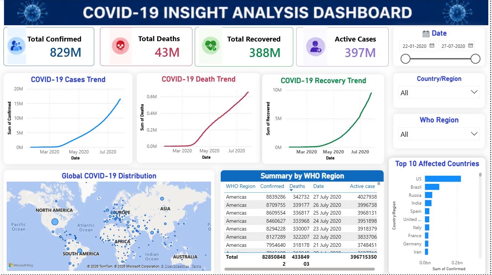

# COVID-19 Insight Analysis Dashboard

## Task 3 - Hard
This project was completed as part of the **Hunar Intern Data Analytics Internship**. The dashboard provides an interactive analysis of global COVID-19 data, helping users monitor confirmed cases, recoveries, deaths, and active cases across different countries and WHO regions.

## Tools Used
- Power BI
- Microsoft Excel / CSV
- Power Query
- DAX
- Bing Maps

## Dashboard Features
- Total Confirmed Cases KPI
- Total Deaths KPI
- Total Recovered KPI
- Active Cases KPI
- COVID-19 Confirmed Cases Trend
- COVID-19 Death Trend
- COVID-19 Recovery Trend
- Global COVID-19 Distribution Map
- WHO Region Summary Table
- Top 10 Affected Countries
- Interactive Filters (Date, Country/Region, WHO Region)

## Dashboard Preview

## Files Included
- covid19 insights analysis dashboard.pbix
- covid_19_cleaned(.csv)
- covid19-insights-analysis-dashboard.png
- README.md

## Key Insights
- Analyze worldwide COVID-19 confirmed, recovered, active, and death cases.
- Monitor daily trends of confirmed, recovered, and death cases.
- Compare COVID-19 impact across countries and WHO regions.
- Identify the top 10 most affected countries.
- Explore geographical distribution of COVID-19 cases using an interactive map.
- Filter dashboard data dynamically by Date, Country/Region, and WHO Region.
